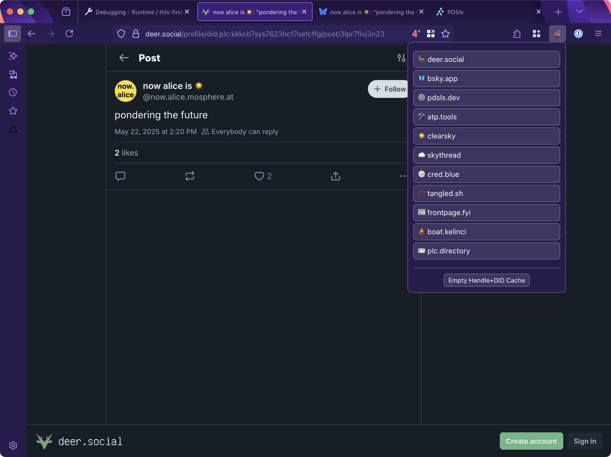

# Wormhole

This is a browser extension that provides "wormhole" navigation between different AT Protocol/Bluesky services inspired by [Dame's Shortcut](https://bsky.app/profile/did:plc:gq4fo3u6tqzzdkjlwzpb23tj/post/3lpcnyrwuzc24). The extension transforms URLs and identifiers from one service to equivalent URLs on other services.

## Supported services

- [deer.social](https://deer.social)
- [bsky.app](https://bsky.app)
- [pdsls.dev](https://pdsls.dev)
- [atp.tools](https://atp.tools)
- [clearsky.app](https://clearsky.app)
- [skythread](https://blue.mackuba.eu/skythread/)
- [cred.blue](https://cred.blue)
- [tangled.sh](https://tangled.sh)
- [frontpage.fyi](https://frontpage.fyi)
- [boat.kelinci.net](https://boat.kelinci.net)
- [plc.directory](https://plc.directory)

If you'd like to add support for another service, please open an issue or submit a pull request.

## Installation

You can install it from the [Chrome Web Store](https://chromewebstore.google.com/detail/wormhole/aihndpeeoneojofmliffjknbegmipbim) or from [Firefox Add-ons](https://addons.mozilla.org/en-GB/firefox/addon/at-wormhole/).
